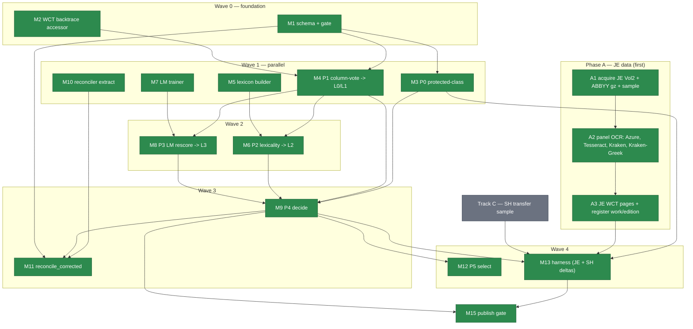

# Build Plan — Gold-Free Corrector Stack (full build)

**This document is the canonical build tracker for the corrector modules (M1–M15) and their
execution units (U0–U12).** It is the single source of truth for corrector build status.

> **⇒ Forward sequencing (2026-07-04):** the remaining chain (Track C → U11 → M15 certification) is
> now sequenced inside the NSH-side campaign — Track C is campaign **batch 09**
> (`plans/tei-reviewer/09-track-c-gold.md`), U11 + M15 certification is campaign **batch 10**
> (`10-u11-m15-certification.md`, attended). The campaign tracker
> (`plans/tei-reviewer/00-progress-tracker.md`) is the "what's next" owner — which
> batch/wave is live; this doc stays the owner of per-module ☑/☐ status and is updated by batch 10
> when U11/U12/TC land. Do not duplicate status between the two.

The orchestrator updates the Status tracker (§0) and
the diagram's done-markers as each module lands — check a box only when its tests are green and the
work is committed (cite the commit). Derived from `docs/DESIGN_gold_free_corrector_locked.md`, the
revised ADR-0014 / ADR-0015 (Accepted 2026-06-05), and
`docs/BUILD_SPEC_corrector_code_from_review.md` (the code-half of the ADR adversarial review,
findings F1–F8). American English; relative paths.

> **Vocabulary pointer (ADR-0016, 2026-06-25).** This tracker uses code-level OCR-pipeline names
> (`WCT`, `sidecar`, `corrected-page`, the stage `S`-numbers). The canonical human-facing names + the
> clean ten-stage taxonomy live in `SHARED-LEXICON.md` (§"NSH OCR pipeline — Layer 1"), with the
> rename map in `docs/adr/0016`. Name-layer only — schema ids, module ids, and stage numbers are
> unchanged. LLM Review scope: `docs/adr/0018`.

## 0. Status tracker

Legend: ☐ not started · ◐ in progress · ☑ done (tests green + committed). Update on every landing.

**Phase A — JE data (run first; the corrector is built and measured against real JE WCT pages):**

| Step | Status | Commit | Notes |
|---|---|---|---|
| A1 JE Vol 2 acquire (IA `cu31924091768196`) + ABBYY gz + stratified article sample | ☑ | 00e1168c | 11 articles, 36 pages; edition-match confirmed; ABBYY cu31924091768196 selected |
| A2 Panel OCR on sample: Azure, Tesseract, Kraken, Kraken-Greek (Surya excluded) | ☑ | efcaab00 | 5-engine panel (incl. Azure) 36/36 pages; all geometry anchors confirmed |
| A3 Build JE WCT pages + register JE as distinct work/edition | ☑ | efcaab00 | 34 WCT pages built (2 permanent LayoutEscalation); `jewish-encyclopedia.vol_02`; M3t=71.0% agg / 66.2% complete-page |

**Phase B — corrector modules:**

| ID | Module | Status | Commit | Blocked by |
|---|---|---|---|---|
| M1 | Schema + validator + gate | ☑ | 2e6224d9 | — |
| M2 | WCT backtrace accessor | ☑ | 1adc97b6 | — |
| M3 | P0 protected-class detectors | ☑ | b02b9211 | M1 |
| M4 | P1 character-column voting | ☑ | 0765e2d8 | M1, M2 |
| M5 | Gold-free lexicon builder | ☑ | a37fdb33 | — |
| M6 | P2 lexicality → L2 | ☑ | 59990bbf | M4, M5 |
| M7 | In-corpus LM trainer | ☑ | fff45ff2 | (scaffold); M4 for L0 text |
| M8 | P3 LM rescore → L3 | ☑ | 31e1fe94 | M4, M7 |
| M9 | P4 decision policy | ☑ | f2aac65c | M3, M4, M6, M8 |
| M10 | Reconciler shared-internals extraction | ☑ | 5d29316f | — |
| M11 | `reconcile_corrected` + sidecar carrier | ☑ | 5f5cb56f | M1, M9, M10 |
| M12 | P5 active-learning selection | ☑ | d646c553 | M9 |
| M13 | Surrogate harness (JE + SH, deltas) | ☑ | cf5a4797 | M3–M9, A3, Track C |
| M14 | Composed-token supersession contract | ☑ | e54bc701 | M1 |
| M15 | Publish gate | ☑ | e8c093e6 | M9, M13 (code built; unflagged-release *certification* still gated on U11 measured rates + TC) |
| TC | Track C — SH transfer sample (human-adjudicated) | ☐ | — | parallel; feeds M13 + M15 |

Prompts drafted (not yet built): M1–M4 at `prompts/2026-06-05-corrector-M1..M4`.

## 0a. Canonical dependency diagram



## Decision brief

- **Build everything, modular, test each.** All of P0–P5 plus the F1–F8 obligations are built and
  TDD-covered. Nothing is deferred for sequencing reasons.
- **The gate is a publication policy, not a build gate.** Every tier is built and measured; the
  surrogate decides only which tiers publish *unflagged* vs *flagged* vs *routed* — per tier, per
  token-class stratum, **per text**. A false correction (a wrong "fix" that reads as clean) is
  worse than an uncorrected OCR error; that is the only thing the gate exists to prevent.
- **The measurement harness is corpus-parametric and runs on JE and SH.** It reports per-tier,
  per-stratum **deltas between corpora**, turning the ADR-0015 transfer question ("does a tier
  safe on JE stay safe on SH?") into a first-class measured output.
- **What matters here is build order, parallelization, and sequential dependency** — §3 is the DAG.
- **Per-component Codex prompts are authored as each wave's upstream interfaces land on disk**
  (roadmap §9; CODEX-10: don't prescribe against an interface that doesn't exist yet). Concrete
  prompts for the buildable-now modules are written today (`prompts/2026-06-05-corrector-*`); later
  waves are specified here and expanded into prompts once their dependencies exist.

## 0b. Execution units (the runbook) — one unit per session

Work is decomposed into context-window-sized units. **One unit = one session.** Each session reads
this tracker, runs exactly one unit via the §1 loop, updates §0, stops, and names the next ready
unit. The §0 tracker is the only cross-session state — there is no carry-over context. Run on
**Sonnet** unless the row says otherwise; the per-module code review is backstopped by failing-first
tests + `standards_check.py` + the full-suite regression gate. Units are launched by the thin
reusable launcher `prompts/2026-06-05-corrector-execute-next-unit.md` (read the build map, do the
next unit, stop), not by N separate orchestrator prompts.

| Unit | Scope | Model | Depends on (all ☑) | Codex prompt |
|---|---|---|---|---|
| **U0** | Phase A.1 — JE acquire + stratified sample + edition-match + prove-votes; STOP at checkpoint | Sonnet | — | `je-surrogate-continue` Phase 1 |
| **U1** | Phase A.2 — panel OCR + build JE WCT pages + register work/edition (A2, A3) | Sonnet | U0 go-ahead | `je-surrogate-continue` Phase 2 |
| **U2** | Wave 0 — M1 schema, M2 WCT accessor | Sonnet | — | corrector-M1, -M2 (exist) |
| **U3** | Wave 1a — M3 P0, M4 P1 | Sonnet | U2 | corrector-M3, -M4 (exist) |
| **U4** | Wave 1b — M5 lexicon, M7 LM-trainer | Sonnet | — | author per-unit |
| **U5** | Wave 1c — M10 reconciler shared-internals extraction (behavior-preserving) | Sonnet | — | author per-unit |
| **U6** | Wave 2 — M6 P2, M8 P3 | Sonnet | U3, U4 | author per-unit |
| **U7** | Wave 3a — M9 P4 decision policy | Sonnet | U3, U6 | author per-unit |
| **U8** | Wave 3b — M11 reconcile_corrected | Sonnet | U7, U5, U2 | author per-unit |
| **U9** | Wave 4a — M12 P5, M14 supersession | Sonnet | U7 (M12), U2 (M14) | author per-unit |
| **U10** | Wave 4b — M13 surrogate harness (build, corpus-parametric JE+SH) | Sonnet | U7, U1 (A3), TC | author per-unit |
| **U11** | Wave 5 — RUN M13 on JE + SH; present per-stratum deltas | **Opus / maintainer** | U10 | measurement read (checkpoint, not the Sonnet launcher) |
| **U12** | Wave 6 — M15 publish gate | Sonnet | U7, U10 | author per-unit |
| **TC** | Track C — SH transfer sample (acquire + human-adjudicate) | Sonnet + human | parallel | author per-unit |

**Parallelism:** U0→U1 (Phase A) runs concurrently with U2→U3→U4→U5 (corrector code needs no JE
data). U10 is the join (needs U7 and U1's A3 and TC). TC runs in parallel throughout. Sizing is
≤2–3 modules per unit because reviewing Codex diffs is the variable context cost; U7 and U10 are
single-module because P4 and the harness are large.

**U11 is the only non-Sonnet unit** — interpreting the JE↔SH measurement deltas (level selection,
do-floors-help, transfer) is a maintainer/Opus read, surfaced per the locked design §9, not run by
the Sonnet launcher.

## 1. Dispatch model (every module)

Claude orchestrates and writes the build prompt → **Codex implements at
`model_reasoning_effort="medium"`** → **Claude reviews, runs `standards_check.py` + the module's
tests, and commits** (CODEX-05; never ask Codex to commit). Each module is one Codex run (one task
per run). TDD: failing tests first, then implementation. Additive only — existing Schaff-Herzog
behavior and the WCT determinism tests stay green. `py -3 -m pytest -p no:cacheprovider`.

## 2. Modules (each independently buildable + testable)

| ID | Module | Path | Maps to | Hard dep |
|---|---|---|---|---|
| **M1** | Schema + validator + falsifiable gate | `schemas/v1/corrected-page-v1.schema.json`; canonical-record fields; `_generated_enums.py`; semantic validator | F2 / locked §4 | — |
| **M2** | WCT weighted-edit-with-backtrace accessor | `build/lib/wct_builder.py` (additive public fn) | HR1 / locked §5.1 | — |
| **M3** | P0 protected-class detectors (proper names, numbers, dates, Scripture refs) | `build/lib/gold_free_corrector/protect.py` | F4 / HR5 | M1 |
| **M4** | P1 character-column voting → L0/L1 + provenance | `build/lib/gold_free_corrector/column_vote.py` | F3 / brief P1 | M1, M2 |
| **M5** | Gold-free lexicon builder | `build/lib/gold_free_corrector/lexicon/build_lexicon.py` | brief P2 | — (reads WCT) |
| **M6** | P2 lexicality rescore → L2 | `build/lib/gold_free_corrector/lexicality.py` | brief P2 / HR2 | M4, M5 |
| **M7** | In-corpus LM trainer (char n-gram + word bigram, L0-only) | `build/lib/gold_free_corrector/lm_train.py` | brief P3 / HR7 | — (scaffold); L0 text from M4 |
| **M8** | P3 in-corpus LM rescore → L3 | `build/lib/gold_free_corrector/lm_rescore.py` | brief P3 / HR8 | M4, M7 |
| **M9** | P4 decision policy (level selection, stratified thresholds, statistical acceptance) | `build/lib/gold_free_corrector/decide.py` | F5+F6 / HR2+HR6 | M3, M4, M6, M8 |
| **M10** | Reconciler shared-internals extraction | `build/lib/s3_reconciler.py` (refactor, behavior-preserving) | locked §5.2 | — (existing code) |
| **M11** | `reconcile_corrected` entry point + sidecar carrier | `build/lib/s3_reconciler.py` | locked §5.3 | M1, M9, M10 |
| **M12** | P5 active-learning selection | `build/lib/gold_free_corrector/select.py` | brief P5 | M9 |
| **M13** | Surrogate harness (corpus-parametric: JE + SH, delta report) | `build/tools/ocr_pipeline/measure_corrector.py` | F5/F6 measurement + F7 | M3–M9, Track B, Track C |
| **M14** | Composed-token supersession contract | schema + `build/lib/gold_free_corrector/` | F8 | M1 |
| **M15** | Publish gate (L0+human unflagged; L1–L3 flagged-until-certified; `machine_composed` label) | `build/lib/gold_free_corrector/publish_gate.py` | F1 | M9, M13 |

**External parallel tracks (not corrector code, but on the critical path for measurement):**

- **Track B — JE surrogate substrate.** ☑ **COMPLETE** (commits `00e1168c`, `efcaab00`, `42a41e37`).
  JE Vol 2 acquired (11 articles, 36 pages), 5-engine panel complete (Azure + Tesseract + Kraken +
  Kraken-Greek + ABBYY), JE WCT pages built (`jewish-encyclopedia.vol_02`), B8 aligner tuning done
  (GAP_PENALTY=0.6 confirmed optimal; no metric change). 24,589 aligned pairs; complete-page
  M3t=66.2% >> M2=53.3%. Track B is **no longer a blocker** — Track C is the sole external gate
  on M13.
- **Track C — SH transfer sample.** A small human-adjudicated Schaff-Herzog set (F7 / ADR-0015).
  Input to M13's SH arm and M15's SH unflagged gate. Human-in-loop; start acquisition in parallel.

## 3. Build order, waves, and parallelization (the DAG)

```
Wave 0 (foundation)     ☑ M1 schema    ☑ M2 WCT accessor    [☑ M14 supersession schema rides M1]
                              │                  │
Wave 1 (parallel)       ☑ M3 P0    ☑ M4 P1    ☑ M5 lexicon    ☑ M7 LM trainer    ☑ M10 reconciler-extract
   deps: M1 ───────────────┘    M1+M2 ──┘    (reads WCT) ┘   (scaffold) ┘    (existing code) ┘
                                  │                │              │
Wave 2 (after P1)       ☑ M6 P2 (M4+M5)    ☑ M8 P3 (M4+M7)   [M7 training run on M4 L0]
                                  └────────┬───────┘
Wave 3 (after correctors)  ☑ M9 P4 (M3+M4+M6+M8)    ☑ M11 reconcile_corrected (M9+M10+M1)
                                  │
Wave 4 (after policy)   ☑ M12 P5 (M9)    ☑ M13 harness (M3–M9 + Track B JE ☑ + Track C ☐)
                                                  │
Wave 5 (MEASURE)        ☐ run M13 on JE (full gold) AND SH (transfer sample)
                          → per-tier/per-stratum false-correction, real-word-error, coverage,
                            and JE↔SH deltas → answers level-selection, do-floors-help, transfer
                                  │
Wave 6 (after data)     ☐ M15 publish gate (consumes M9 + M13 certification; statistical acceptance)
```

**Parallelism summary**

- **Corrector code (Waves 0–4) complete; Track B (JE surrogate) complete.** The only remaining
  external gate on M13 is Track C (human SH transfer sample). Start Track C immediately.
- **Within Wave 1, M3/M4/M5/M7/M10 are mutually independent.** M2 and M10 touch shared SH files
  (`wct_builder.py`, `s3_reconciler.py`); M4/M5/M7 are new package files. To dispatch Wave 1 in
  parallel without index/file collisions, give each Codex run worktree isolation (or sequence the
  two shared-file edits M2→M10 and parallelize the new-file modules).
- **Critical path to the first real number:** all corrector code (M1–M14) is done. Track C (human
  SH transfer sample) is the sole remaining gate on Wave 5. Once TC is adjudicated, M13 can be
  built and run immediately — no other dependencies are pending.

## 4. The measurement that answers the open questions (Wave 5)

M13 emits, per `(corpus, level, method, token-class, script, typography, engine-mix)` stratum:
`coverage`, `false_correction_rate` (denominator = auto-accepted only), `cer`,
`real_word_error_rate` (HR4, distinct from CER), `non_word_error_rate`, `route_rate`,
`protected_class_leak_rate` (target 0), and the **JE↔SH delta** for each.

From those numbers, by data not doctrine:
- **Level selection** — simulate lowest-derivation vs highest-confidence vs highest-coverage over
  the surrogate; pick the policy with the lowest real-word-error at acceptable coverage.
- **Do fixed floors earn their keep** — floors-on vs floors-off; keep only if they cut
  false-correction beyond the surrogate threshold alone.
- **Transfer** — any stratum whose SH false-correction exceeds its JE rate by more than the
  confidence interval is held flagged for SH even if JE-certified.
- **Statistical acceptance** — a stratum auto-accepts only with denominator ≥ required N
  (`ceil(log(0.05)/log(0.999)) = 2995` for a 95% upper bound < 0.1%); under-powered strata stay
  flagged. No silent auto-accept on a thin sample.

## 5. Invariants every module inherits

- Gold-free (HR7): no human-adjudicated label feeds the corrector; the LM trains on WCT L0
  consensus only, excluding the current run's own L1–L3 output (a test pins this).
- Per-character provenance complete (HR3): winners, synthesized chars, deletions, **and filtered
  losing glyphs**; the gate fails closed on any L≥1 token missing provenance.
- Protected classes route before any score is read (HR5).
- LLM/VLM author canonical text only via the tagged, surrogate-measured L3 path (HR8).
- Degraded mode untouched: corrector output never overwrites `reconcile_degraded`'s `original_text`;
  the matrix gate (`_assert_no_premature_matrix_labels`) is preserved verbatim.
- Public label for L1–L3 is `machine_composed`, never "attested" (ADR-0014).

## 6. Concrete prompts authored today

Buildable-now (Wave 0 + Wave 1), each a standalone Codex run at medium:
- `prompts/2026-06-05-corrector-M1-schema.md`
- `prompts/2026-06-05-corrector-M2-wct-backtrace.md`
- `prompts/2026-06-05-corrector-M3-protected-class.md`
- `prompts/2026-06-05-corrector-M4-column-vote.md`

Later waves (M5–M15) are specified in §2–§3; their prompts are written as each upstream interface
lands, so they cite real signatures rather than projected ones.
